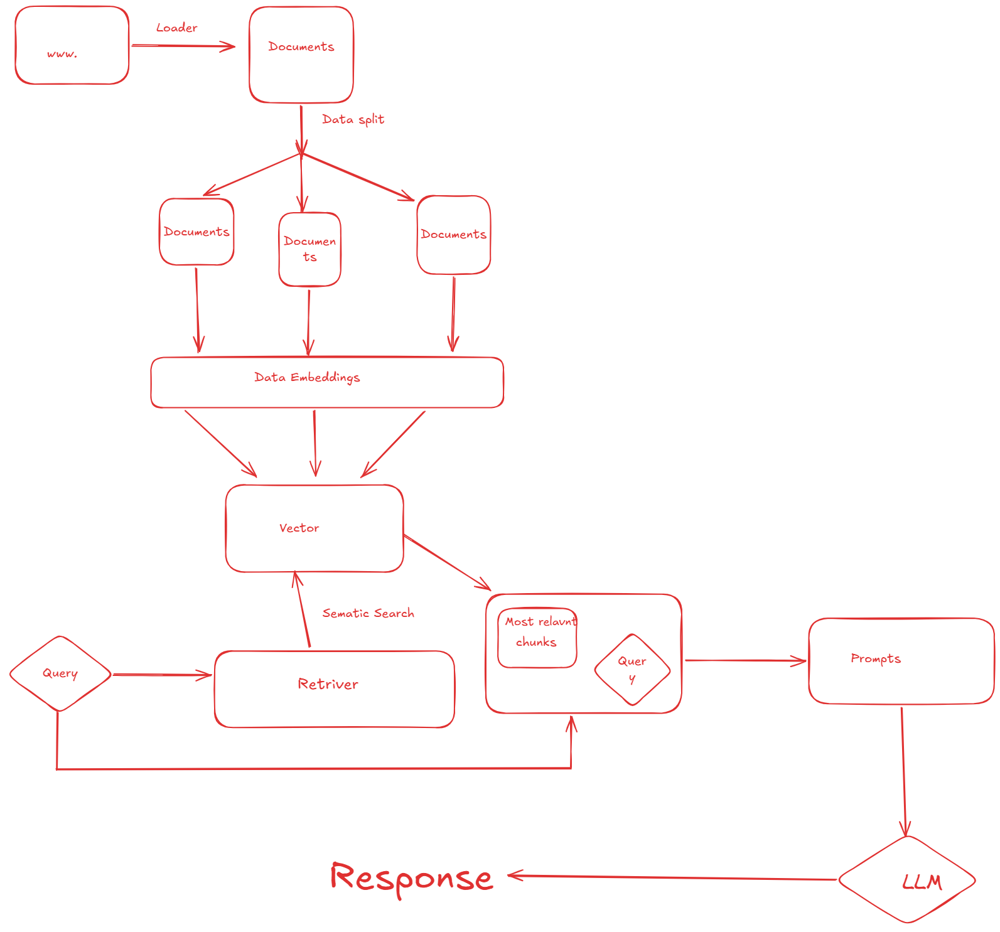

# 🎥 YouTube Chatbot using LangChain (RAG Architecture)

🚀 **This project is built using a Retrieval-Augmented Generation (RAG) architecture**, where YouTube video transcripts are processed, embedded, and used to answer user queries intelligently using LLMs.

---

## 🔄 RAG Architecture



---

## 🧠 Project Overview

This project allows users to:
- 🔗 Input a YouTube video URL  
- 📄 Extract transcript automatically  
- 🧩 Split text into chunks  
- 🧠 Convert text into embeddings  
- 🔍 Perform semantic search using FAISS  
- 💬 Ask questions and get accurate answers  

---

## ⚙️ How It Works

1. 📺 Extract transcript from YouTube video  
2. ✂️ Split transcript into smaller chunks  
3. 🧠 Generate embeddings using HuggingFace (MiniLM)  
4. 🗄️ Store embeddings in FAISS vector database  
5. 🔎 Retrieve relevant chunks using semantic search  
6. 🧾 Pass context + query into Gemini LLM  
7. 💡 Generate final answer  

---

## 🛠️ Tech Stack

- **Python**
- **Streamlit**
- **LangChain**
- **Google Gemini (LLM)**
- **HuggingFace Embeddings**
- **FAISS (Vector Database)**
- **YouTube Transcript API**

---

## 📂 Project Structure
├── main.py # Streamlit app
├── requirements.txt # Dependencies
├── rag.png.png # Architecture diagram
├── README.md

---

## ▶️ Installation

```bash
git clone https://github.com/your-username/YouTube-Chatbot-using-LangChain-.git
cd YouTube-Chatbot-using-LangChain-
pip install -r requirements.txt

🔑 Setup
.env
GOOGLE_API_KEY=your_api_key_here
▶️ Run the App
streamlit run main.py

💡 Features
🎯 Accurate Q&A from video content
⚡ Fast retrieval using FAISS
🧠 Context-aware answers (RAG pipeline)
🌐 Simple UI using Streamlit


🚀 Deployment
Deployed on Render
Environment variables used for API keys (secure)


🧠 Key Learning
Implemented RAG pipeline from scratch
Handled vector search + embeddings
Integrated LLM with real-world data
Optimized system to avoid API rate limits


📌 Future Improvements
Add chat memory
Support multiple videos
Improve UI/UX
Add summarization feature


🤝 Contributing

Feel free to fork and contribute!

📜 License

This project is open-source and available under the MIT License.
